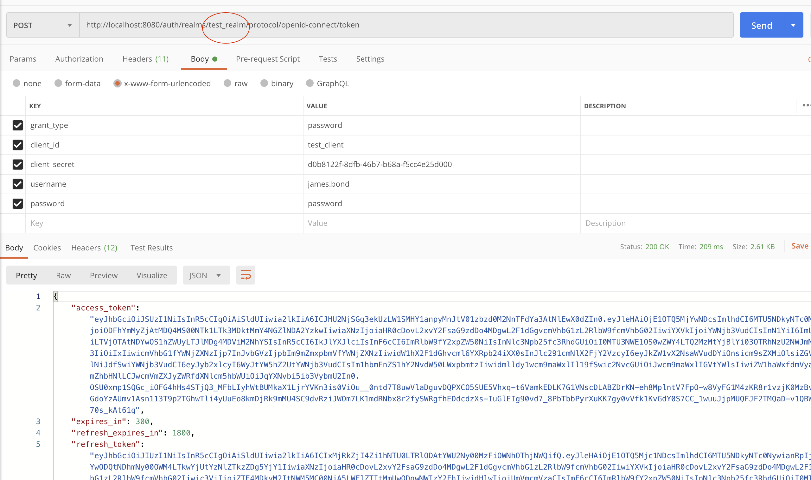

# keycloak-docker-script
Starts a keycloak instance and creates test realm, client, role, users etc.

To start a keycloak instance, just run **./runKeycloak.sh**. Then make a token request immediately! 

